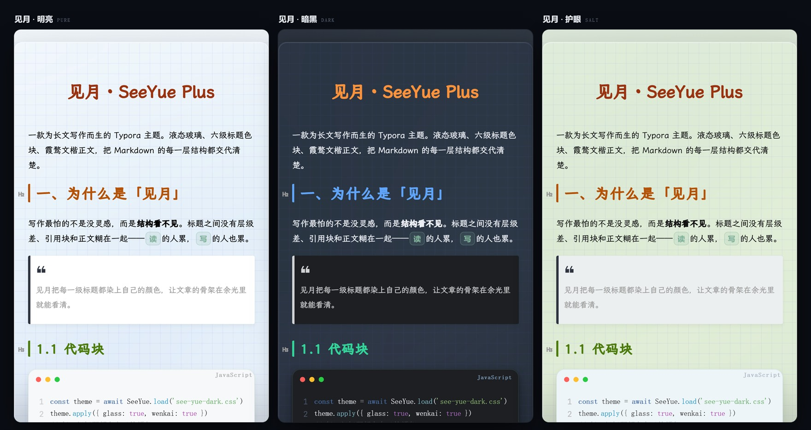

<div align="center">

# 见月 · SeeYue Plus

**给长文写作的一套排版秩序**

一款为 Typora 而生的主题
液态玻璃 · 六级标题色阶 · 霞鹜文楷 · 打印级 PDF 导出

[](https://yanxinwu946.github.io/SeeYuePlus/)
[](https://typora.io/)
[](#三套配色)



</div>

## 三套配色

|  | 主题 | 文件 | 底色 | 什么时候用 |
| :-: | --- | --- | --- | --- |
| ☀︎ | **见月 · 明亮** | `see-yue-pure.css` | `#f0f4f8` | 白天写、认真校色、准备付印 |
| ☾ | **见月 · 暗黑** | `see-yue-dark.css` | `#1a1d24` | 凌晨三点，屏幕不扎人 |
| ☘ | **见月 · 护眼** | `see-yue-salt.css` | `#e4eddf` | 长夜与长文之间的一档缓冲 |

同一套排版规则，换三种底色。配色各自独立成文件，改一个变量就能长出你自己的第四套。

## 装进 Typora

克隆，跑 `make sync`，重载。需要 Git 与 make，Git for Windows 自带。

```bash
git clone https://github.com/yanxinwu946/SeeYuePlus.git
cd SeeYuePlus
make sync
```

同步进 `%APPDATA%\Typora\themes`，然后 <kbd>Ctrl</kbd> + <kbd>R</kbd>，在主题菜单里选。

没有 make？[下载压缩包](https://github.com/yanxinwu946/SeeYuePlus/archive/refs/heads/main.zip)，解压后把三份 CSS 和 `SeeYue` 文件夹放进主题目录。

<div align="center">
<sub>用着不顺手，或者想加点什么 —— 欢迎提 <a href="https://github.com/yanxinwu946/SeeYuePlus/issues">Issue</a></sub>
</div>
